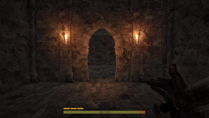
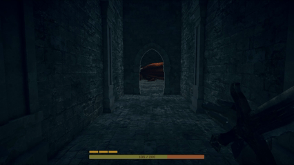
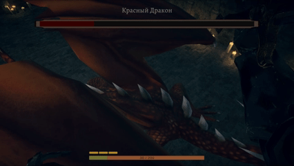
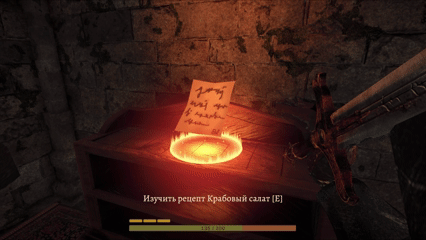

# Hell Yeah

Рогалик, целью которого является дойти до конца подземелья, сразиться с красным драконом и приготовить из него легендарное блюдо.

## Лагерь

Стартовая локация игрока, он же лобби между забегами, он же место для приготовления еды

  
  
  

## Подземелье

Состоит из 3 этажей, каждый процедурно генерируется одним из 2 генераторов:

### Тип генерации "Сосиска"

<table align="center">
  <tr>
    <td align="center">
      
    </td>
    <td align="center">
      
    </td>
  </tr>
  <tr>
    <td align="center">
      
    </td>
    <td align="center">
      
    </td>
  </tr>
</table>

### Тип генерации "Вафля"

<table align="center">
  <tr>
    <td align="center">
      
    </td>
    <td align="center">
      
    </td>
  </tr>
  <tr>
    <td align="center">
      
    </td>
    <td align="center">
      
    </td>
  </tr>
</table>

## Комнаты подземелья

  
  
  
  
  
  
  

## 💀Враги 

  

## Босс и его арена

  
  

## Рецепты

  

## Интерфейс

  
  

  

<h2 align="center">Невероятная четверка</h2>

<table align="center">
<tr>

<td align="center" width="270" valign="top">
<a href="https://github.com/dianakonushkina">
 
<b>tongzhi</b>
</a>

<h3></h3>

• Создание локаций 
• Боевая система 
• UI (Frontend)

</td>

<td align="center" width="270" valign="top">
<a href="https://github.com/octomors">
 
<b>octomors</b>
</a>

<h3></h3>

• Процедурная генерация 
• Архитектура проекта 
• Система сохранений 
• Оптимизация

</td>

<td align="center" width="270" valign="top">
<a href="https://github.com/lubaaabul">
 
<b>lubaaabul</b>
</a>

<h3></h3>

• Система готовки 
• Инвентарь 
• UI (Backend)

</td>

<td align="center" width="270" valign="top">
<a href="https://github.com/bigmage123">
 
<b>bigmage123</b>
</a>

<h3></h3>

• Модель и анимации рук 
• Баланс  
• Hell Yeah 

</td>

</tr>
</table>
